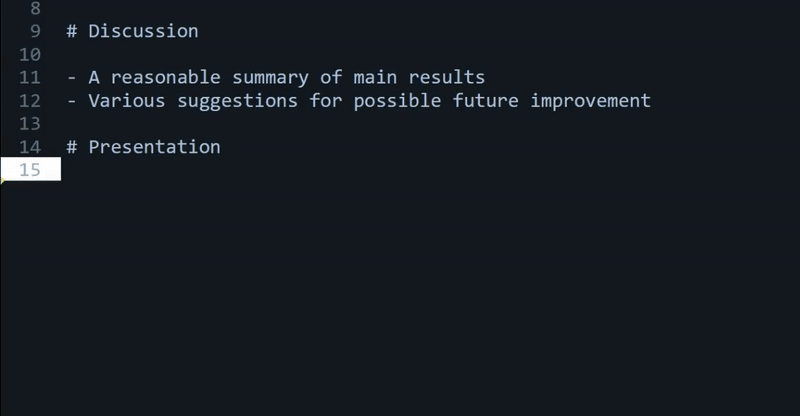

# MarkingFeedback

A Sublime Text plugin for context-sensitive autocompletion suggestions.

The plugin makes it possible to re-use previously written comments within an assessment rubric (e.g., consisting of sections such as "Motivation", "Methodology", "Analysis", "Conclusions", etc). It works similar to an autocompletion function in code editor: when you start typing a keyword, previously written comments with that keyword will appear in an autocompletion menu. However, only those suggestions are shown that are relevant to the rubric section you are currently typing in:



To install the plugin:

(1) Install [Sublime Text](https://www.sublimetext.com/download).

(2) Download the plugin from [github](https://github.com/vpekar/marking-feedback): it includes two files, `MarkingFeedback.py` and `MarkingFeedback.sublime-settings`.

(3) In Sublime Text, select "Preferences" -> "Browser packages..." -> "User" and paste the two files into the User folder. Restart Sublime Text.

(4) Create a repository of comments you previously written: This should be a plain-text file, where the name of the rubric section appears on a separate line and is preceded with a "#", and past comments relating to this section appear below, one in each line. See the example file included with the plugin. Save the file anywhere on your computer, e.g., under `C:\Users\<username>\comments_repository.txt`.

(5) In "MarkingFeedback.sublime-settings", specify the location of the file under "repository_path":

```
{
    "repository_path": "C:\Users\<username>\comments_repository.txt"
}
```

To use the plugin:

(1) In a new plain-text document in ST, create the same marking rubric as in the comments repository file, where each section appears on a separate line, preceded by "#".

(2) Within a particular section, start typing a keyword and hit "tab" to bring up a context menu. Use the arrow keys + Enter to select a suggested comment.